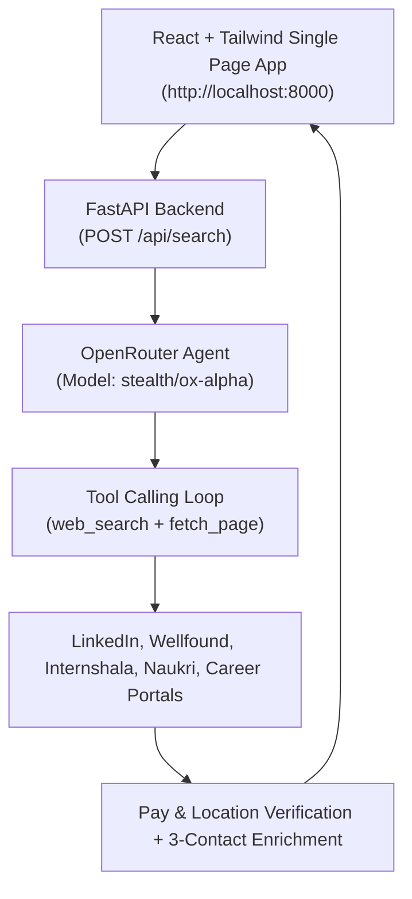

# 🚀 AI Internship Finder (Hyderabad Paid AI Roles)

An autonomous Web Application and Talent Scout that searches the internet for verified **PAID** AI Engineer / Agentic AI Engineer internships in **Hyderabad**, verifies stipends, attaches direct **LinkedIn points of contact (HR, Tech Lead, Founder/CEO)**, and renders application-ready lead cards.

---

## ⚡ Quick Start

### 1. Configure Environment Variables
Copy `.env.example` to `.env` and add your OpenRouter API key:

```bash
# In .env:
OPENROUTER_API_KEY=sk-or-v1-your-key-here
OPENROUTER_MODEL_ID=stealth/ox-alpha
PORT=8000
```

> **Note on Model Slug:** The OpenRouter model slug for **"OX Alpha"** is `stealth/ox-alpha`. You can also configure other models such as `anthropic/claude-3.5-sonnet` or `openai/gpt-4o-mini`.

### 2. Launch the Web Application

```powershell
python start_web.py
```
This starts the FastAPI backend server and automatically opens `http://localhost:8000` in your web browser.

---

## 🖥️ UI & Application Features

1. **Filter Bar**:
   - **Role input & presets**: `AI Engineer Intern`, `Agentic AI Engineer`, `GenAI Intern`, `ML Engineer`, `LLM Engineer`, `AI Research`.
   - **Location constraint**: Defaults to `Hyderabad` and enforces physical engineering office verification.
   - **Paid Only Toggle**: Defaulted ON and locked to guarantee zero unpaid listings.
2. **Interactive Results Grid**:
   - **Company & Role**: Highlighting company name and role title.
   - **Stipend Confirmation Badge**: Displays exact verified stipend (e.g. `💰 ₹35,000/mo - Confirmed`).
   - **3-Tier LinkedIn Outreach Links**:
     - 👤 **HR / Recruiter** LinkedIn URL + 1-Click Pitch Copy
     - 💻 **Tech / AI Lead** LinkedIn URL + 1-Click Tech Pitch Copy *(Highest Conversion)*
     - 👔 **Founder / CEO** LinkedIn URL + 1-Click Executive Pitch Copy
   - **Cold Reach Rationale**: Specific 1–2 sentence outreach angle.
   - **Direct Apply Button**: One-click link to official company career listing.

---

## 🛠️ Architecture



---

## 📦 Project Structure

```
C:\Education\vs\agents\
├── .env.example               # OpenRouter key & model slug template
├── .env                       # Local environment configuration
├── README.md                  # Setup & usage documentation
├── start_web.py               # 1-Click web app launcher
├── config.json                # JSON config for CLI runner
├── web/
│   ├── backend/
│   │   ├── server.py          # FastAPI server & static file host
│   │   ├── openrouter_client.py # OpenRouter tool-calling agent
│   │   └── search_tools.py    # Web search & page fetch tools
│   └── frontend/
│       └── index.html         # React + Tailwind SPA with live filters
└── core/                      # Reusable CLI & Telegram dispatcher engine
```
